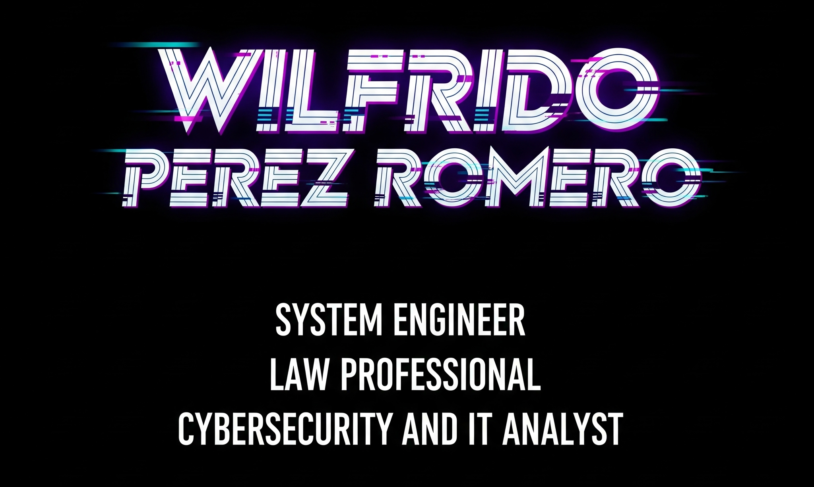

# ¡Hello, I'm Wilfrido! 👋

## Welcome to my space.


_You can connect with me on [LinkedIn](https://www.linkedin.com/in/wilfridocostarica)._

Here I share 💻 projects, ✨aspirations as a 👨‍💻 Systems Engineer, ⚖️ Law Professional, and 🛡️Cybersecurity and IT expert. You will also find valuable content on a variety of other topics :octocat: with the aim of giving back to the community and 🤝supporting everyone's professional and personal development.

---

## **My Projects and Areas of Interest:**

| Category           | Description                                                                                               |
| :------------------ | :-------------------------------------------------------------------------------------------------------- |
| 🚀 **Git & GitHub** | [Explore my resources on version control and collaboration.](https://github.com/Echo506/CV/blob/463067d0a1b27e437d49d4801597a46c332b3337/Github.md) |
| 🐍 **Python** | [Discover my Python projects and scripts.](https://github.com/Echo506/CV/blob/463067d0a1b27e437d49d4801597a46c332b3337/Python.md) |
| 🗄️ **SQL** | [Dive into my databases and SQL queries.](https://github.com/Echo506/CV/blob/463067d0a1b27e437d49d4801597a46c332b3337/SQL.md) |
| 📊 **Splunk** | [Data analysis and security with Splunk.](https://github.com/Echo506/CV/blob/463067d0a1b27e437d49d4801597a46c332b3337/Splunk.md)         |
| ⚔️ **Metasploit** | [Tools and techniques for penetration testing.](https://github.com/Echo506/CV/blob/463067d0a1b27e437d49d4801597a46c332b3337/Metasploit.md) |
| 🛡️ **Threat Intel** | [Learn about my work on threat intelligence (MITRE ATT&CK).](https://github.com/Echo506/CV/blob/463067d0a1b27e437d49d4801597a46c332b3337/MITRE%20ATT%26CK.md) |

---

## **My Tools:**

| Tool                     | Description                                                                                               |
| :----------------------- | :-------------------------------------------------------------------------------------------------------- |
| 🔒 **Infra-Sec-Check** | [Tool for infrastructure security verification.](https://github.com/Echo506/CV/blob/463067d0a1b27e437d49d4801597a46c332b3337/InfraSec.md) |
| 🔎 **Offensive Scan Tool** | [My tool for offensive scanning.](https://github.com/Echo506/CV/blob/463067d0a1b27e437d49d4801597a46c332b3337/OfficeScanTool.md) |
| 🚨 **SSH Detector** | [Alert system for SSH detections.](https://github.com/Echo506/CV/blob/463067d0a1b27e437d49d4801597a46c332b3337/SSHDetector.md)                               |

---

## **My Language Skills:**

| Language        | Description                                                                                               |
| :-------------- | :-------------------------------------------------------------------------------------------------------- |
| 🇫🇷 **French** | [Resources and projects related to the French language.](https://github.com/Echo506/CV/blob/463067d0a1b27e437d49d4801597a46c332b3337/French.md) |
| 🇧🇷 **Portuguese** | [Content and learning in Portuguese.](https://github.com/Echo506/CV/blob/463067d0a1b27e437d49d4801597a46c332b3337/Portugues.md) |
| 🇨🇳 **Chinese** | [My progress and resources in the Chinese language.](https://github.com/Echo506/CV/blob/463067d0a1b27e437d49d4801597a46c332b3337/Chinesse.md) |
```


